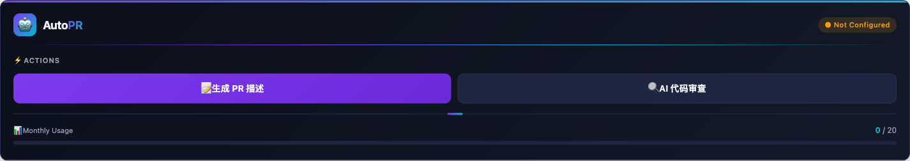
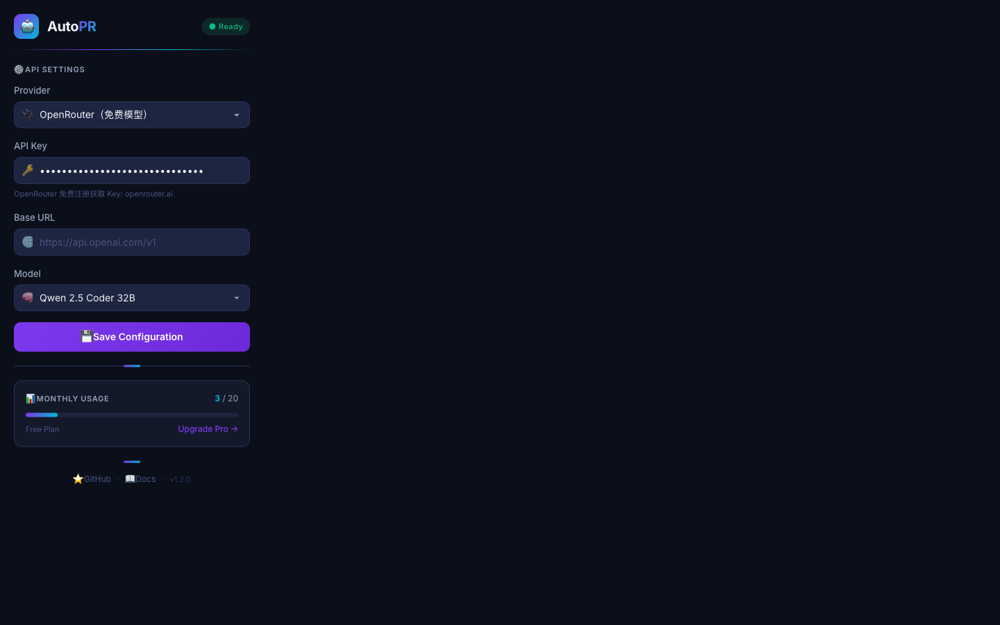
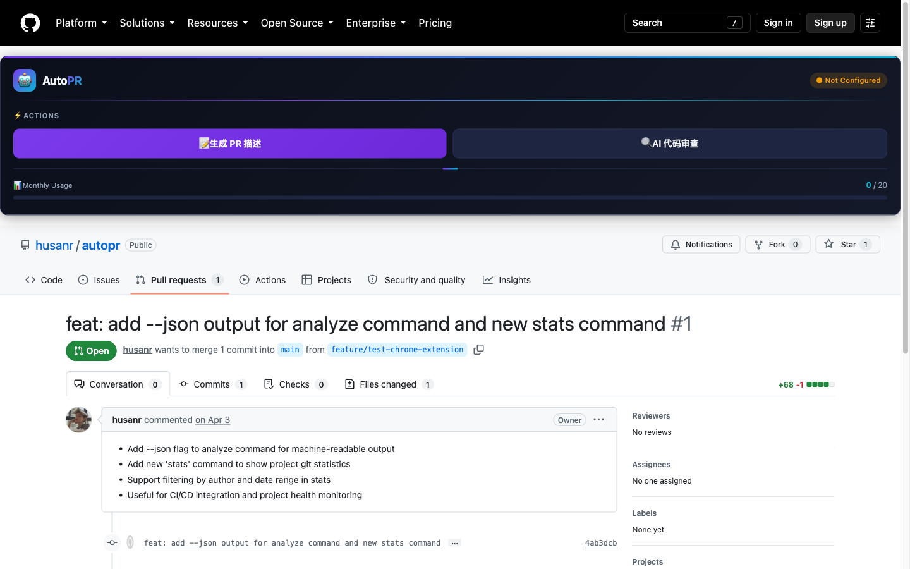

<p align="center">
  
</p>

<h1 align="center">AutoPR 🤖</h1>

<p align="center">
  AI-Powered Pull Request Assistant — a <b>Chrome extension</b> + <b>CLI</b> that generates PR descriptions and performs intelligent code reviews in one click.
</p>

<p align="center">
  <a href="https://github.com/husanr/autopr/actions"></a>
  <a href="LICENSE"></a>
  <a href="https://github.com/husanr/autopr/issues"></a>
  
</p>

<p align="center">
  <a href="README.md">English</a> • <a href="README.zh-CN.md">中文</a>
</p>

---

## ✨ Features

- 🧩 **Chrome extension** — an AutoPR panel is injected into every GitHub PR page. One click to generate a professional PR description or run an AI code review.
- ⌨️ **CLI** — diff analysis, PR description generation, complexity scoring, project statistics and benchmarks for scripting and CI pipelines.
- 🔌 **Any OpenAI-compatible API** — OpenAI, DeepSeek, OpenRouter (free models), DashScope/Qwen, vLLM, Ollama… configure once, done.
- 📦 **Zero server** — your API key stays in local storage / env vars. All requests go straight from your browser or terminal.
- 🆓 **Free to use** — works with OpenRouter's free models out of the box.

## 🚀 Getting Started

### 🧩 Chrome extension (recommended)

1. Clone the repo: `git clone https://github.com/husanr/autopr.git`
2. Open `chrome://extensions/`, enable **Developer mode**
3. Click **Load unpacked** → select the `extension/` folder
4. Click the AutoPR icon → enter your API key (see [AI config](#-ai-configuration))
5. Open any GitHub pull request page and use the panel

### ⌨️ CLI

```bash
cd cli
npm install
npm run build

# analyze a diff file
node dist/cli/index.js analyze -d test/sample.diff

# generate a PR description (uses the AI if AUTO_PR_AI_API_KEY is set)
node dist/cli/index.js pr-description -d test/sample.diff

# review an open PR and post the result as a comment
node dist/cli/index.js review -p 42 -o husanr -r autopr --post
```

## 🤖 AI Configuration

| Env var | Description | Default |
|---|---|---|
| `AUTO_PR_AI_API_KEY` | API key (fallback: `OPENAI_API_KEY`) | — |
| `AUTO_PR_AI_BASE_URL` | Any OpenAI-compatible endpoint | `https://api.openai.com/v1` |
| `AUTO_PR_AI_MODEL` | Model name | `gpt-4o-mini` |

Without a key, the CLI gracefully falls back to the built-in rule templates.

## 📸 Screenshots

| Extension panel on a PR page | Settings (popup) |
|---|---|
|  |  |



## 📁 Project Structure

```
autopr/
├── extension/   # Chrome extension (Manifest V3, vanilla JS)
│   ├── background.js   # service worker: AI calls, usage limits
│   ├── content.js      # GitHub PR page injection
│   ├── popup.html/js   # settings UI (API key, provider, model)
│   └── store-assets/   # Chrome Web Store listing materials
├── cli/         # CLI tool (TypeScript, Commander)
│   ├── src/core/       # diff analyzer, rules engine, quality checker
│   ├── src/ai/         # LLM integration (OpenAI-compatible)
│   ├── src/github/     # GitHub API client
│   └── test/           # Vitest unit tests + diff fixtures
└── .github/workflows/  # CI: build, test, lint manifests
```

## 🤝 Contributing

See [CONTRIBUTING.md](CONTRIBUTING.md) — issues and PRs are welcome!

## 📄 License

[MIT](LICENSE) © 2026 husanr